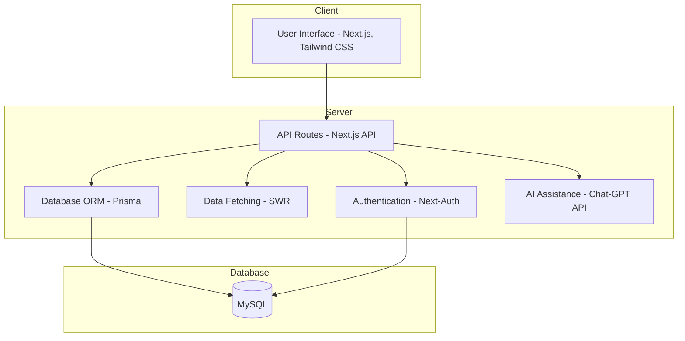

# 똑디 (똑똑한 스터디 - AI를 활요한 면접 도우미)
프로젝트 기간: 2024.01.06 ~ <strong>holidng</strong> 
인원: 1인 개발 
사용 기술: Next.JS, Next-Auth, SWR, Prisma, Typescript, Tailwind, Chat-GPT Assistanst API 
배포(임시): https://smart-youth.vercel.app/ 

`똑디`는 AI를 활요한 면접 도우미입니다. 개발자 면접에서 나오는 질문이 어느정도 정해져 있다는 점에서 착안해 개발한 면접 준비 사이트입니다. 이 프로젝트는 Next.JS, Next-Auth, SWR, Prisma, MySQL, Typescript, Tailwind, Chat-GPT Assistanst API 등을 사용하여 개발됩니다.

### 기술 스택
프론트엔드: Next.JS, Tailwind CSS, Typescript  
백엔드: Next.JS (API Routes), Prisma  
인증: Next-Auth  
데이터 페칭: SWR  
API 연동: Chat-GPT Assistanst API  

## Architecture

### 프론트엔드

페이지 렌더링: 사용자에게 보이는 웹 페이지를 렌더링합니다. 
UI 컴포넌트: Tailwind CSS로 스타일링된 UI 컴포넌트를 사용합니다. 
SWR로 데이터 페칭: 클라이언트 측에서 데이터를 효율적으로 가져오고 캐싱합니다.
### 백엔드

API 라우트: 클라이언트에서 오는 요청을 처리하고 필요한 데이터를 제공합니다. 
Next-Auth로 인증: 사용자 인증 및 세션 관리를 처리합니다. 
Prisma로 DB 액세스: 데이터베이스와 상호작용하여 데이터를 읽고 씁니다.
### 데이터베이스(MySQL)

사용자 정보: 사용자 계정 및 프로필 정보를 저장합니다. 
게시물 데이터: 사용자들이 게시하는 글과 댓글을 저장합니다. 
기타 커뮤니티 데이터: 댓글, 추천 등 커뮤니티 활동과 관련된 데이터를 저장합니다.
### 외부 API

Chat-GPT Assistanst API: Chat-GPT API를 통한 AI 어시스턴트 기능을 통합합니다. 
